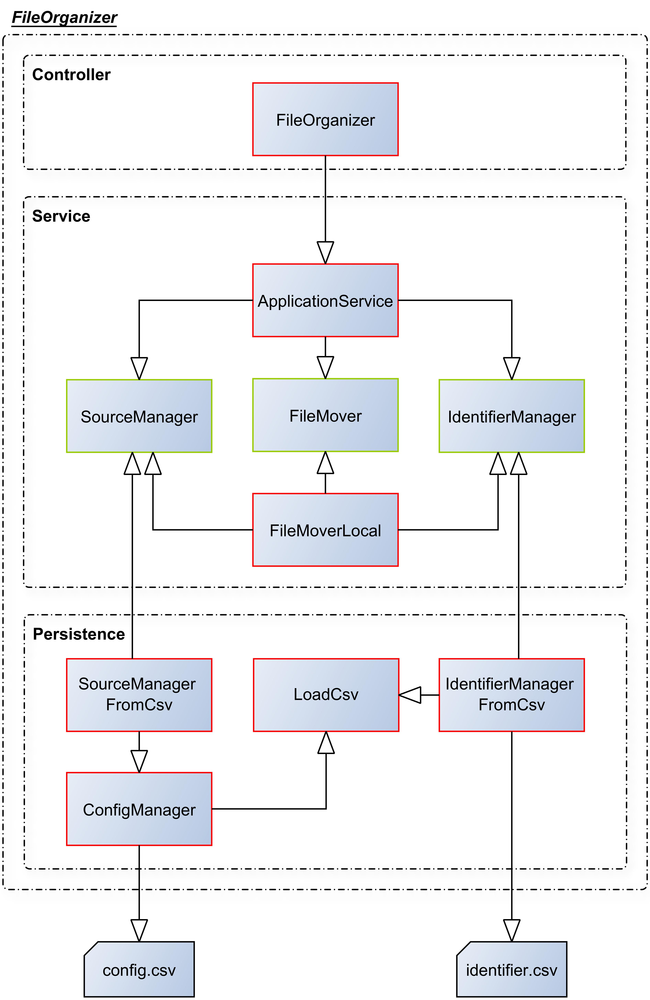

= FileOrganizer
:icons: font
:icon-set: fa
:source-highlighter: rouge
:experimental:

== Description
FileOrganizer as a tool wants to bring order back to your messy desktop. Everything works by adding a prefix to your filenames like e.g. __note_lecturenotes.docx_. If you configured is beforehand, FileOrganizer will sort them automatically into the right folder, no matter how deep it is burried. It will also remove the given prefix, so there is nothing to worry about.

== Documentation
=== Startup
FileOrganizer is still in developement. Because of this, it can currently not run as a background process yet. Starting it with Gradle will work as intended, though it will terminate after the files are moverd.

=== Features
* Moving files to a target path by using a dedicated identifier prefix
* Using a custom source folder from which the files will be fetched by using the _config.csv_
* Adding prefix-path-pairs by using the _identifier.csv_

=== Pending Features
* Running as a background process
* UI for creating and deleting id-path-pairs, changing the source folder
* Pop-up for creating new id-path-pairs when naming a file in the __newid_filename.txt_ pattern
* Support for cloud folder upload by adding prefix

=== Quality objectives
* Easy replaceability of persistence layer
* Open design for easy extension

=== Context

=== Glossar
* *IDENTIFIER* - Prefix that triggers file transfer
* *ID-PATH-PAIRS* - Entry of IDENTIFIER and path of destination after transfer
* *SOURCE* - Folder in  which the program looks for files
* *CONFIG* - Includes source folder path and future settings

